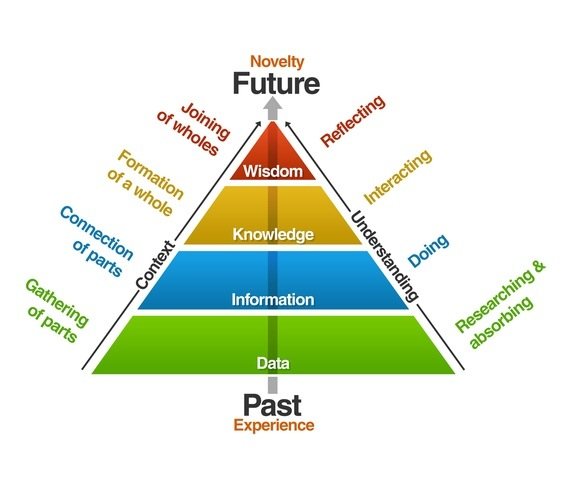



A close up of text on a white background Description automatically generated

**According to the DIKW hierarchy, it is implicitly assumed that data can be
used to create information, information can be used to create knowledge, and
knowledge can be used to create wisdom. There is no wisdom without knowledge,
there is no knowledge without information, and there is no information without
data. Do you agree or disagree with this view? Justify your stand.**

**Justification:** It was in his treatise, *Discourse of Methods,* where Rene
Descartes wrote, *“je pense, donc je suis”* (I think, therefore I am)
(Descartes, 1637). We can all agree that it is probably the wisest thing any
Frenchman has ever written. But, where does such wisdom come from? Surely, it
can’t exist in a vacuum by itself. Monsieur Descartes was, at the time, working
his way through an existential crisis and was probably unaware of the general
wisdom he was divulging. Where did his wisdom originated from? Surely, it came
from his thoughts, which was based on his knowledge of life, which he gained
through experiences. All his experiences were stored as information in his mind
by billions of neurons and synapses.

With that view of Rene’s mind, let’s start at the top of the DIKW hierarchy and
ask the question - can wisdom exist without knowledge? Personally, I battle to
fathom such a situation. How can one make wise decisions without knowing
anything? I don’t believe we can. The same goes for knowledge – can we be
knowledgeable about something without holding any information on the subject?
Again, I don’t think this is possible.

The DIKW hierarchy succeeds in explaining the idea that there exists a natural
order to the flow of knowledge. The structure of the hierarchy, presented as a
pyramid, unashamedly spells out the concept that there is a progression from
data to information to knowledge and eventually to wisdom (Rowley, 2007).

The pyramid structure also suggests that there is a natural ratio that exists
between each of the layers of the pyramid and that the further we traverse up
the hierarchy the scarcer the next entity of the hierarchy becomes. This
resonates well with the well-known “Maslow’s hierarchy of needs” (“Maslow’s
hierarchy of needs,” 2019). Although, I’m sure the French would argue that *la
petite mort* and a few good baguettes are way more important than data.

**According to the DIKW hierarchy, it is estimated that on average about 40 per
cent of the human mind consists of data, 30 per cent information, 20 per cent
knowledge, 10 per cent understanding, and very minimal wisdom. That is, there is
less information than data, less knowledge than information, and less wisdom
than knowledge. This is why the hierarchy is also called the knowledge pyramid.
Do you agree or disagree with this view? Can we have more information than data
or more knowledge than information? Justify your stand**

**Justification:** At best, I would argue, that we can only *assume* the human
mind holds data, information, knowledge and wisdom in the proportions as
suggested. I say this because, we still don’t know exactly how the human mind
works (Gorman, 2018). The initially mentioned assumption stems from our
observation from the natural world around us. For instance, we witness enormous
amounts of data being stored in databases. We can measure the volume of data
that is stored and the rate at which it flows in and out of our storage devices.
This ability makes data a very tangible object and therefore we accept it as the
base layer of the pyramid structure; and not necessarily because it is the
absolute truth but, rather because it is a comfortable proposition.

The next layer, information, is measurable as suggested by information theory.
Information theory utilises *entropy* to quantify the amount of uncertainty
involved in the value of a random variable (Shannon, 1948), which suggests the
*shannon (symbol:Sh)* measure. Highly organised data, such as found in
databases, contains low entropy and therefore a high level of information.

The next two levels of the hierarchy, knowledge and wisdom, have no quantifiable
dimensions by which they can be measured. For instance, we can only refer to the
amount of knowledge as a general quantity, e.g. little, average or vast amounts
of knowledge. The same goes for wisdom. I think it is due to this human
inability to parameterize knowledge and wisdom vs. the quantifiable *gigabyte*
and s*hannon* that makes us naturally assume that wisdom is less than knowledge,
which in turn is less than information, which in turn is less than data. The
DIKW hierarchy, with its pyramid shape, enforces this idea and makes it very
easy to accept.

**Even though there are some debates on the hierarchy, it is a
‘taken-forgranted’ notion in data science and information science. What are
possible criticisms and potential drawbacks of the hierarchy (including both
your own opinion and an analysis of what you find in research literature)?
Investigate and research criticism and potential drawbacks of the hierarchy, and
list three to five (3-5) of them with justification**

**Justification:** To state it blandly, the DIKW wisdom hierarchy is just not
comprehensive enough. Some authors criticize the pyramid structure of the DIKW
and state that it is too simplistic. They argue that a more complex structure,
such as a *tetradian*, could better describe the hierarchy (Graves, 2012). It
might sound a bit *avant-*garde but, by suggesting a more complex geometrical
structure, some authors create additional dimensional space wherein they can
introduce new augmented ideas to the DIKW hierarchy. For instance,

*context,* which frames information; *connections*, which links data items and
context; *purpose,* which serves as a structure to give guidance towards wisdom
(Graves, 2012).

At best, I would agree that the DIKW hierarchy is a *general* portrayal of
knowledge flow and serves well as a blanket theory that places data,
information, knowledge and wisdom in an acceptable and easily consumable human
context. In other words, the DIKW hierarchy resonates well with humans because
it is easily consumable in its current, simplistic portrayal.

The DIKW concept also facilitates and creates awareness about the ideas that
flows around and from the concept. For instance, it entices us to look deeper
into ideas such as meaning, insight, informativeness, principles, believes and
intent. The latter mentioned ideas can be grouped into even higher abstract
ideas such as strategy, game theory and eventually wisdom itself. Hence, the
frustration of contemporary thought leaders with the current restrictive pyramid
structure.

Finally, I think that the DIKW hierarchy lends itself well to form an elegant
synergy with the bi-directional, temporal flow of the chronological order of the
individual concepts in the hierarchy, i.e. data facilitates information, which
facilitates knowledge, which facilitates wisdom, which flows back into
knowledge, which creates information and eventually is stores as data. Maybe a
new geometrical shape is required to incorporate many of the additional,
well-intended ideas into a new DIKW hierarchy - DIKW Mk II?

**There are several types of data/information systems: transaction processing
systems, management information systems, data warehouses, decision support
systems, and expert systems. Map the DIWK hierarchy to these types of
information systems and justify your mapping. For instance, you might start your
response with ’Data warehouses are mapped to the information level in the
hierarchy, because they are…’, or ’Data warehouses are mapped to the knowledge
level in the hierarchy due to…’**

**Justification:** At the most fundamental level we can map any system, which
has the capability to store, process and move data, to the data layer in the
DIKW hierarchy. Transaction processing systems facilitate the movement of highly
organized and structured data and can therefore be mapped to the information
level in the DIKW hierarchy.

With the idea that information can be gathered from data once data is ordered
and contextualise (Shannon, 1948), we can assume that databases and data
warehouses are mapped to both the data and information layers in the DIKW
hierarchy. However, data warehouses are designed around subjects (Inmon, 2000),
which means that the information they contain offers a knowledge base to its
users (“KMS-Techopedia,” 2019). Although one can argue that *subject orientated*
information constitutes explicit knowledge (e.g. business intelligence), one can
also argue that *contextualized* information carries implied knowledge.
Knowledge management systems should encompass both explicit and implied
knowledge and therefore, we can also map data warehouses to the knowledge level
of the DIKW hierarchy.

Decision support systems are information systems that support businesses in
decision-making activities (“Decision support system,” 2019). This means that
highly focussed knowledge is presented and suggested to decision makers by
decision support systems. Therefore, we can say that decision support systems
can be mapped to the knowledge level of the DIKW Hierarchy.

Expert systems is said to utilises artificial intelligence to mimic human
intelligence (“Expert system,” 2019). Expert systems function on two subsystems,
inference engine and a knowledge base (“Expert system,” 2019). It is stated that
expert systems solve problems by “reasoning” through bodies of knowledge. I’m
still a sceptic of this idea and I would, at most, agree that these expert
systems could only mimic the process of reasoning, Non-the-less, besides humans,
expert systems are probably the closest entity which we can map to the wisdom
level of the DIKW hierarchy.

**Ackoff stated that “From all this I infer that although we are able to develop
computerized information-, knowledge- and understanding-generating systems, we
will never be able to generate wisdom by such systems.” Do you agree or disagree
with Ackoff’s statement? Justify your stand.**

**Justification:** In order to understand why wisdom cannot be generated by
machines, we need to understand what wisdom is. Wisdom is an abstract concept,
which is non-quantifiable. At best we can categorize wisdom as either good or
bad. By portraying something as good or bad we inevitably drag morality into the
equation, which in turn is driven by principles and believes.

According to the DIKW hierarchy we reach wisdom once we transcend knowledge. In
my view an intermediary step is needed to complete this jump from knowledge to
wisdom; and that step is *opinion*. Once a certain level and amount of knowledge
has been attained regarding a *gestalt*, an opinion can be formed. Although the
opinion of a *corpus* arises from knowledge it is tempered by the overarching
principles and believes of the *corpus*. Once an opinion has been formed, it
inevitably leads to intent. Without an opinion there could be no intent, and
intent is what drives strategy. Although opinion is not *fact* (“Opinion,”
2019), it is the intermediary step required to get to wisdom, which is
influenced by believe, which is also not *fact.* Once we leave the realm of
*fact* (data, information, knowledge), we enter a sphere of abstract thought in
which wisdom resides.

All the above concepts, ideas and entities form the inner workings of wisdom.
Going from knowledge to wisdom is an entirely human endeavour. Machines, I
doubt, will ever have the capability to foster wisdom as based on the elements
suggested above. I want to go further and state that wisdom is based on life
experience, the ability to reflect, to project and to interpolate. No machine
will ever possess the ability to reflect upon its life events. To a machine
those events are only raw bits of data.

References
----------

Decision support system. (2019). In *Wikipedia*. Retrieved from
https://en.wikipedia.org/w/index.php?title=Decision_support_system&oldid=887840577

Descartes, R. (1596-1650) A. du texte. (1637). *Discours de la méthode pour bien
conduire sa raison et chercher la vérité dans les sciences , plus la dioptrique,
les météores et la géométrie qui sont des essais de cette méthode*. Retrieved
from https://gallica.bnf.fr/ark:/12148/btv1b86069594

Expert system. (2019). In *Wikipedia*. Retrieved from
https://en.wikipedia.org/w/index.php?title=Expert_system&oldid=887929729

Gorman, J. (2018, January 19). Learning How Little We Know About the Brain. *The
New York Times*. Retrieved from
https://www.nytimes.com/2014/11/11/science/learning-how-little-we-know-about-the-brain.html

Graves, T. (2012). Rethinking the DIKW hierarchy – Tom Graves / Tetradian.
Retrieved March 15, 2019, from
http://weblog.tetradian.com/2012/11/07/rethinking-the-dikw-hierarchy/

Inmon, W. H. (2000). Subject Orientation, 19.

KMS-Techopedia. (2019). Retrieved March 17, 2019, from
https://www.techopedia.com/definition/7962/knowledge-management-system-kms

Maslow’s hierarchy of needs. (2019). In *Wikipedia*. Retrieved from
https://en.wikipedia.org/w/index.php?title=Maslow%27s_hierarchy_of_needs&oldid=886393744

Opinion. (2019). In *Wikipedia*. Retrieved from
https://en.wikipedia.org/w/index.php?title=Opinion&oldid=884415070

Regan, B. (2014). The Very, Very Inspiring “DIKW” Hierarchy \| Brendan Regan’s
Digital Marketing, Conversion Optimization, and Marketing Optimization Blog.
Retrieved March 16, 2019, from
http://brendan-regan.com/the-data-information-knowledge-wisdom-hierarchy/

Rowley, J. (2007). The wisdom hierarchy: representations of the DIKW hierarchy.
*Journal of Information Science*, *33*(2), 163–180.
https://doi.org/10.1177/0165551506070706

Shannon, C. E. (1948). A mathematical theory of communication. *The Bell System
Technical Journal*, *27*(3), 379–423.
https://doi.org/10.1002/j.1538-7305.1948.tb01338.x

